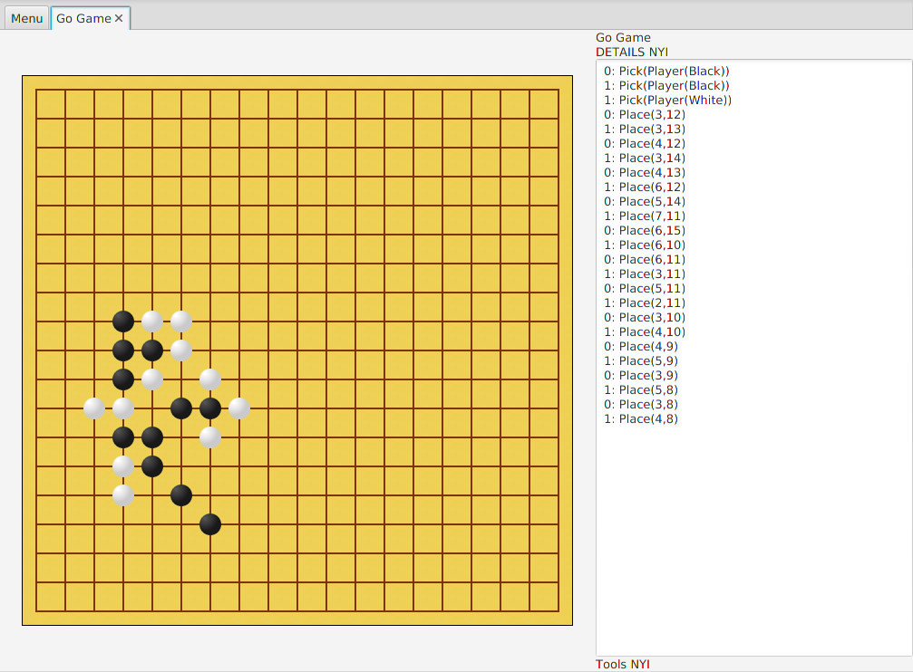
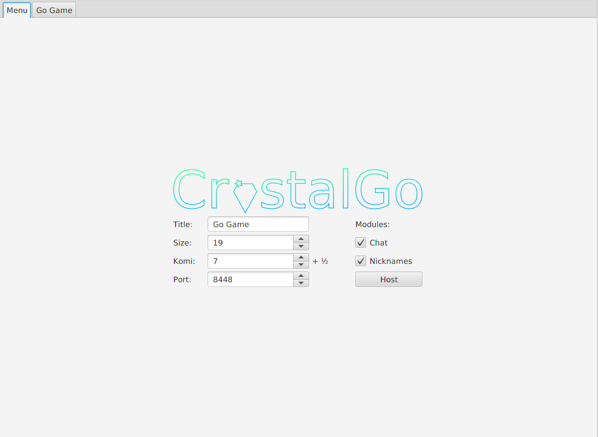
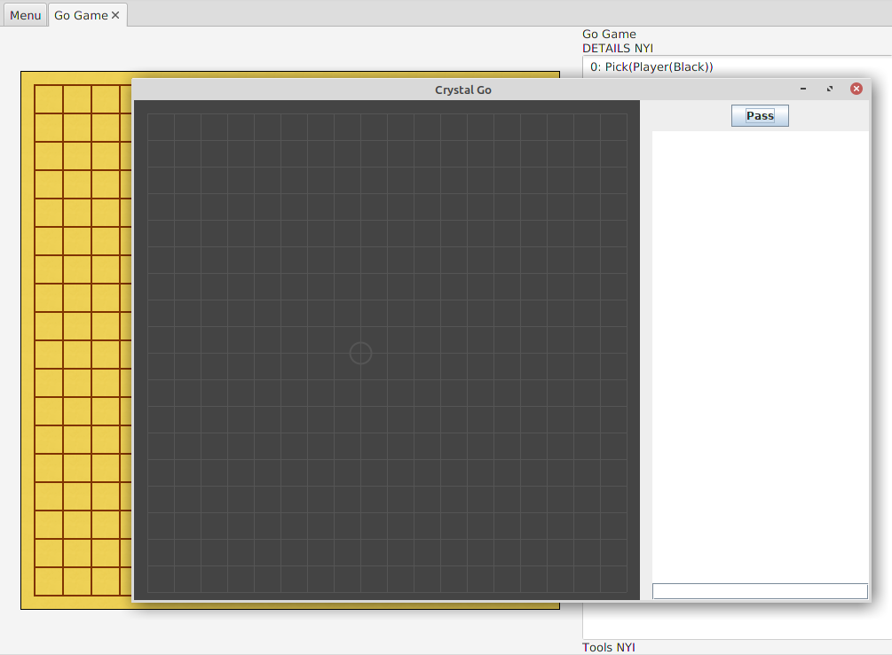

CrystalGo
===

CrystalGo is a partial implementation of the board game Go. It contains a server that can host Go games over the network, and a client that can connect to these games and allow the player to play.

The basic functionality of playing the game is in place. However, there are a number of missing placeholder features that would support more options and convenience for the player if they had been implemented; so if some part of it doesn't work, then likely it is because it is a placeholder feature.

Setup
---

In order to compile the program, you must have sbt installed. Using sbt, you can enter into the repository folder and write `sbt compile`.

There are two executables in the repository, the server and the client. To run them, write `sbt run`. sbt will then give you the option of choosing between `CrystalMain`, which is the client, and `CrystalHost`, which is the server. In order to start a game, you must first start `CrystalHost`. Once opened, its UI looks like the following:

Some of the functions in the menu, such as the board size or the modules, are not yet implemented. However, hosting the game is implemented. Once you press 'Host', a server will start which waits for clients to join. The protocol is very simple and so TELNET could be used as a client. However, CrystalGo also has a client program to permit more convenient play. Once the client, `CrystalMain`, has been started, it opens a dialog box asking for the server IP address. One joined, the CrystalGo client and CrystalGo server both open up a graphic with the current board state.

Once two clients have joined, they can start playing the game.
